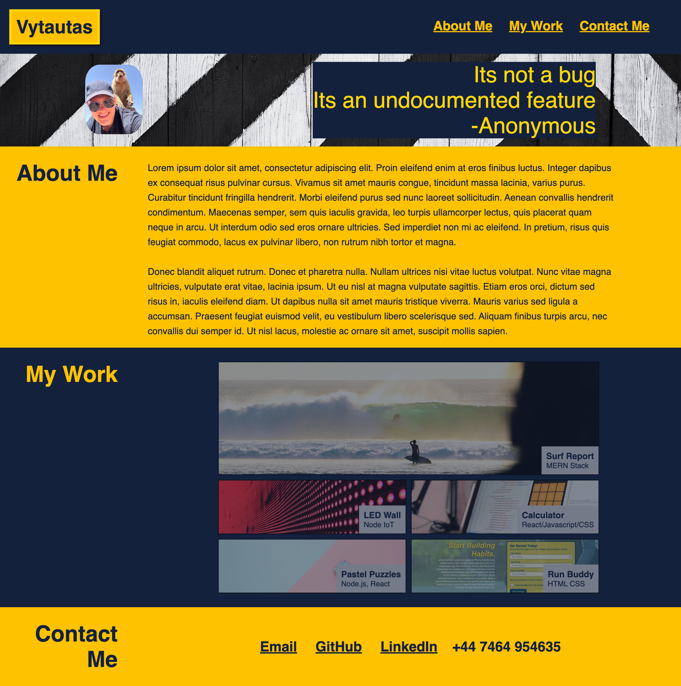

# Responsive Portfolio Challenge

## Description 
The purpose of this challenge was to utilise the skills we learned in this weeks bootcamp by creating a portfolio website from scratch following an example image. We were required to use an example image/video of what the finish portfolio website should look like and build the site from scratch using HTML and CSS. The website has to be responsive and change layout to accomodate different sized screens using media queries. 

The motivation for this project was to take all the key learning in the first week of lessons and put them to use in a real world scenario by building a personal portfolio that will be used as a digital CV to showcase all coding projects that I have built.

The project was built to consolidate knowledge and usage of HTML, CSS and git best practices. It was also used to design a complete website, with links, headers, images while being fully responsive

This project solves key problems such as making a the website responsive and look professional across any device. The layout is simple and follows best practives for web development by using a header, hero section, main content area and a footer. 

Key learnings: 

1. Use HTML to build website structure
2. How to use basic git commands such as add, commit and push to save changes in a repository such as Github
3. Use css selectors to change the formatting of the webpage
4. Use media queries to make website responsive and professional looking on a range of devices
5. How to comment on html and css files to provide better understanding of the code to others who may read the codebase. 
6. How to upload the code to a Github pages site and use the inspect tool to see how the code works.

## Acceptance Criteria
Here is a list of criteria that has to be met to pass the challenge: 

When the page is loaded the page presents your name, a recent photo or avatar, and links to sections about you, your work, and how to contact you

1. When one of the links in the navigation is clicked then the UI scrolls to the corresponding section
2. When viewing the section about your work then the section contains titled images of your applications
3. When presented with the your first application then that application's image should be larger in size than the others
4. When images of the applications are clicked then the user is taken to that deployed application
5. When the page is resized or viewed on various screens and devices then the layout is responsive and adapts to my viewport

## Installation

There is no installation needed for this website.

## Usage 
This application was built for the purpose of completing a bootcamp test. 

1.[Click here to access the reposity where the code for this project is stored](https://github.com/vytautastv/vyPortfolio)

2.[Click here to access the live website hosted on Github pages](https://vytautastv.github.io/vyPortfolio/)

Here is a screenshot of the finished landing page which can be accessed with the above link to Github pages: 

## Credits

Tutorials/resources used to assist with this project:

1. [HTML elements](https://developer.mozilla.org/en-US/docs/Web/HTML/Element)
2. [HTML accessibility](https://developer.mozilla.org/en-US/docs/Learn/Accessibility/HTML)
3. [Git commands guide](https://youtu.be/mJ-qvsxPHpY?si=hrjrNl7UcZ7e6aFs)
4. [CSS selectors tutorial](https://youtu.be/l1mER1bV0N0?si=bpEWtqXew2Lxo7eU)

## License
This project is licensed under MIT, please refer to the LICENSE file that is seen in the codeRefactor repo to find additional details related to the license used in this project.

---

© 2023 edX Boot Camps LLC. Confidential and Proprietary. All Rights Reserved.